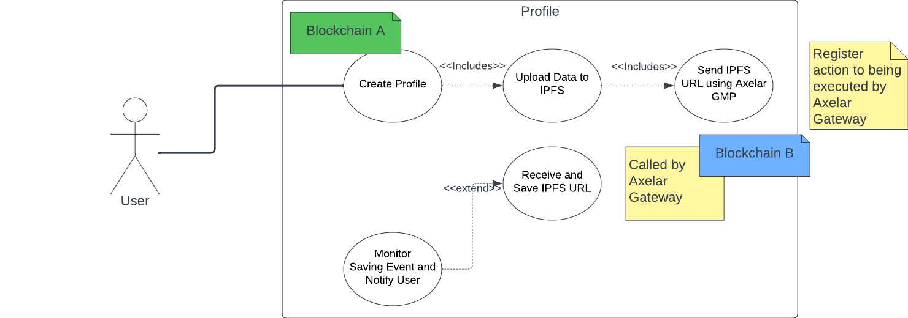
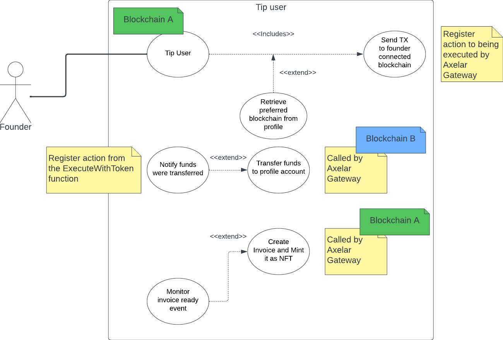
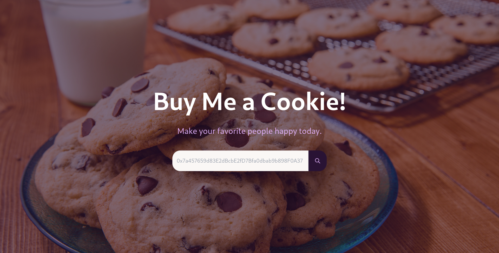
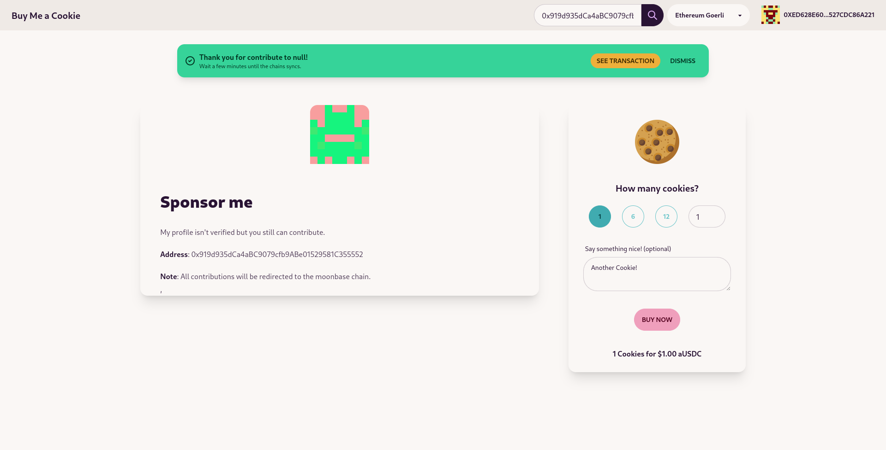
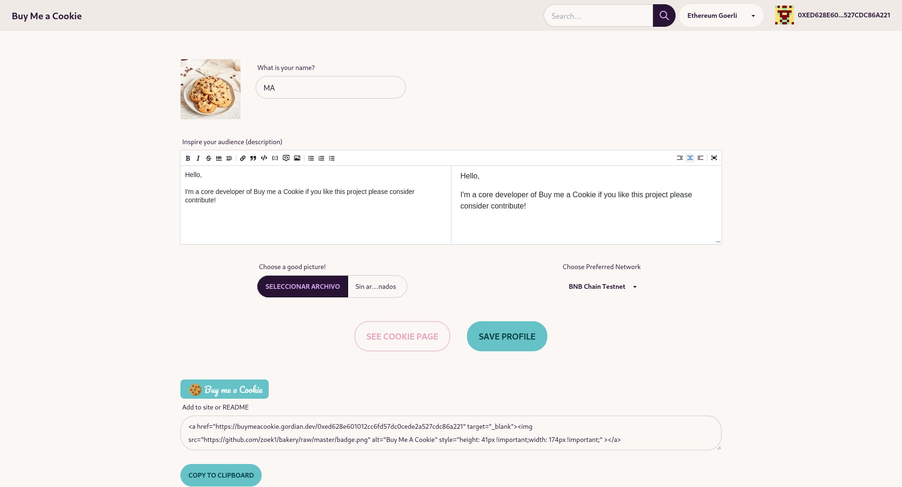
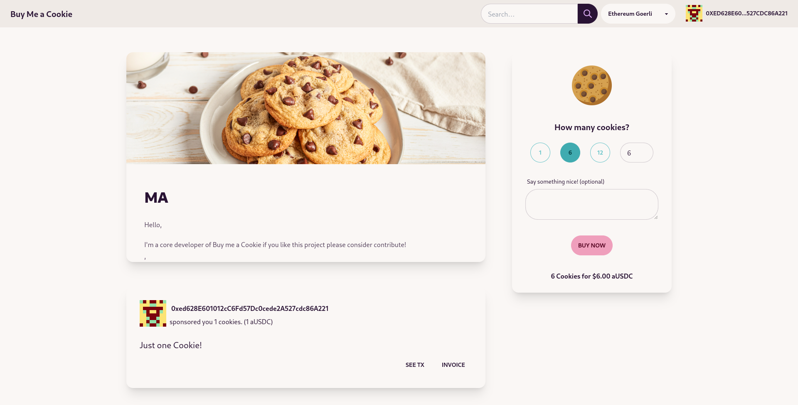

# Buy me a cookie (Bakery)

[](https://buymeacookie.gordian.dev/0x919d935dCa4aBC9079cfb9ABe01529581C355552)


Give your audience an easy way to say thanks.

## Video Demo
WIP

## Setup
```
yarn
```

## Generate new address
Save the private and public key
```
node scripts/generator.js
```
**Note**: Add funds from faucets of your favorite projects. (Polygon, Moonbase, BSC, ETH Goerli, Fantom, Avax).
Also some aUSDC will be required.

## Compile and Deploy Contracts

```
yarn exec hardhat compile
node scripts/deploy.js testnet <EVM_ADDRESS>
```

## Deploy contracts
Contract is deployed to following networks, so user can recive and transfer fund in any chain,
and it will be forwarded to the corresponding chain:
- Polygon
- Moonbase
- BSC
- ETH Goerli
- Fantom
- Avax

```
export EVM_PRIVATE_KEY=<private key>
node scripts/deploy.js testnet <public key>
```

## Start Server
```
yarn start
```

## Badge 

### Using inlined HTML

<a href="https://buymeacookie.gordian.dev/0x919d935dCa4aBC9079cfb9ABe01529581C355552" target="_blank"></a>

```
<a href="https://buymeacookie.gordian.dev/0x919d935dCa4aBC9079cfb9ABe01529581C355552" target="_blank"></a>
```

### Using Markdown

[](https://buymeacookie.gordian.dev/vitalik.eth)

```
[](https://buymeacookie.gordian.dev/vitalik.eth)
```
## Flow
### Create or Update Profile


### Make donation and get invoice



## User Interactions
### Search any address (ENS domain are also supported)

### Support anonymous (not verified) users 

### Create your profile and get verified

### Support verified user and see all contributions
You get one invoice nft for every contribution you made in the chain you made the contribution!
The implementation to see invoice is planned in the phase 2, but all NFT Invoice are registered.
Example: https://goerli.etherscan.io/token/0x76040b4BC87F63C041F9cF87c3262b68D0f78b8C?a=60529387034361429577519350380435008093014593915793362066010911254699636853777#inventory




## Backlog
**Phase 1**
- [X] As user I can create a profile from any chain (using Axelars GMP)
- [X] As user I can set my preferred chain to receive tips (using Axelars GMP)
- [X] As user I can receive tips even if i'm not registered but with a warning 
- [X] As user I can see my profile page if i'm registered (quering deployed contracts)
- [X] As user I can see all tips i received across all blockchains (quering deployed contracts)
- [X] As sponsor I tip with aUSDC any valid address or ENS name using Axelars GMP
- [X] As user I get the profile page when i paste one address or ENS name in the searchbar
- [X] As user I get a badge to include in my repository

**Phase 2**
- [X] As sponsor I receive one NFT for contribute to X profile using Axelars GMP
- [ ] As user I can configure reward and memberships for certain contributions using Axelars GMP
- [ ] As sponsor I can set recurrent contributions
- [ ] Add widget to embedd in sites
- [ ] Add my contributions page to display all invoice and NFT i got
